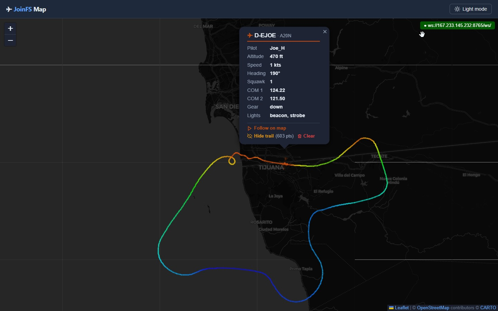

# `<joinfs-map>` — Live Aircraft Map Web Component

A self-contained, zero-dependency web component that displays live aircraft positions on an interactive [Leaflet](https://leafletjs.com) map, fed by a [JoinFS](https://www.fs-hub.com/joinfs) WebSocket server.



**Features**

- Drop-in single-file component — no npm, no bundler, no configuration
- Connects to a JoinFS WebSocket server and renders aircraft in real time
- Aircraft icons loaded from [joeherwig/AircraftIconsSVG](https://github.com/joeherwig/AircraftIconsSVG) — real silhouettes per aircraft type
- Colors reflect altitude (ADSBExchange style: orange → green → blue → magenta)
- Dark / light / auto theming with live tile-layer switching (OpenStreetMap light, Esri Dark Gray Canvas dark — both keyless)
- Follow an aircraft by callsign or pilot name — via attribute or URL query string
- Popup with full flight-plan data (type, route, altitude, speed, COM, squawk, lights, engines…)
- Auto-reconnects on WebSocket disconnect; stale aircraft purged automatically

---

## Download

Grab the single component file and include it in your page:

```
https://raw.githubusercontent.com/joeherwig/joinfs-map-websocket-webcomponent/main/joinfs-map.js
```

Or clone the repo:

```bash
git clone https://github.com/joeherwig/joinfs-map-websocket-webcomponent.git
```

---

## Quick start

```html
<!DOCTYPE html>
<html lang="en">
<head>
  <meta charset="UTF-8">
  <meta name="viewport" content="width=device-width, initial-scale=1.0">
  <title>JoinFS Map</title>
</head>
<body style="margin:0">

  <joinfs-map
    uri="ws://localhost:8765/ws/"
    lat="51.0"
    lon="10.0"
    zoom="6"
    style="width:100vw;height:100vh;display:block"
    label-css="filter: sepia(1) saturate(4) hue-rotate(0deg) brightness(.7); opacity: .5;">
  </joinfs-map>

  <script src="https://raw.githubusercontent.com/joeherwig/joinfs-map-websocket-webcomponent/main/joinfs-map.js"></script>
</body>
</html>
```

Open the page while JoinFS is running with WebSocket support enabled (`Settings → Network → Enable WebSocket server`). Aircraft appear as coloured silhouettes as soon as position data arrives.

---

## Fullscreen example

A ready-to-use fullscreen demo with dark/light toggle and URL-based follow support lives in [`example/index.html`](example/index.html).

```html
<!DOCTYPE html>
<html lang="en">
<head>
  <meta charset="UTF-8">
  <meta name="viewport" content="width=device-width, initial-scale=1.0">
  <title>JoinFS Live Map</title>
  <style>
    *, *::before, *::after { box-sizing: border-box; margin: 0; padding: 0; }
    html, body { height: 100%; background: #0f172a; }
    joinfs-map  { width: 100%; height: 100vh; display: block; }
  </style>
</head>
<body>

  <joinfs-map
    id="map"
    uri="ws://localhost:8765/ws/"
    stale-timeout="60"
    lat="51.0"
    lon="10.0"
    zoom="6"
    theme="auto"
    icon-size="5">
  </joinfs-map>

  <script src="https://raw.githubusercontent.com/joeherwig/joinfs-map-websocket-webcomponent/main/joinfs-map.js"></script>
  <script>
    const mapEl = document.getElementById('map');
    const params = new URLSearchParams(location.search);

    // ?callsign=DLH123  or  ?pilot=Joe  — follow an aircraft on load
    const follow = params.get('callsign') || params.get('pilot');
    if (follow) mapEl.setAttribute('follow', follow);

    // ?iconsize=3  — override icon size (0–10)
    const sz = params.get('iconsize') ?? params.get('icon-size');
    if (sz !== null) mapEl.setAttribute('icon-size', sz);

    // ?label-css=...  — restyle the dark-theme place-name overlay (URL-encoded CSS)
    const labelCss = params.get('label-css') ?? params.get('labelcss');
    if (labelCss !== null) mapEl.setAttribute('label-css', labelCss);

    // Mirror follow changes back to the URL (keeping label-css if present)
    mapEl.addEventListener('joinfs-follow', e => {
      const url = new URL(location.href);
      const keepLabelCss = url.searchParams.get('label-css');
      url.search = '';
      if (e.detail?.callsign) url.searchParams.set('callsign', e.detail.callsign);
      if (keepLabelCss !== null) url.searchParams.set('label-css', keepLabelCss);
      history.replaceState(null, '', url.toString());
    });
  </script>
</body>
</html>
```

---

## Attributes

| Attribute | Type | Default | Description |
|---|---|---|---|
| `uri` | string | `ws://localhost/ws/` | Full WebSocket URI including protocol, host, port and path. Supports optional query parameters. |
| `lat` | number | `51.0` | Initial map centre latitude. |
| `lon` | number | `10.0` | Initial map centre longitude. |
| `zoom` | integer | `6` | Initial Leaflet zoom level (0 – 19). |
| `theme` | `auto` \| `light` \| `dark` | `auto` | Map and UI colour scheme. `auto` follows the browser's `prefers-color-scheme` setting and updates live when the OS switches. |
| `icon-size` | integer 0–10 | `5` | Aircraft icon size. 0 = smallest, 5 = medium (default), 10 = largest. Can also be set via the `?iconsize=` URL query parameter. |
| `stale-timeout` | integer | `60` | Seconds after which an aircraft that has stopped sending updates is removed from the map. |
| `label-css` | string | — | Dark theme only. A raw CSS declaration list applied to the place-name (city/country label) overlay, e.g. `filter: sepia(1) saturate(4) hue-rotate(180deg); opacity: 0.33;` to tint the labels and dim them. Unset = the overlay renders as-is. The overlay is raster tiles, so labels are recoloured via image filtering (`filter`), not as text. Can also be set via the `?label-css=` URL query parameter (URL-encoded). |
| `follow` | string | — | Callsign or pilot nickname to keep centred on the map. Case-insensitive. Can also be set via `?callsign=` or `?pilot=` URL query parameters. |

---

## Events

The component fires one custom event on the host element:

| Event | `detail` | Description |
|---|---|---|
| `joinfs-follow` | `{ callsign: string \| null }` | Fired when the user clicks "Follow on map" or "Stop following" inside a popup, or dismisses the follow badge. `callsign` is `null` when following is cleared. Bubbles and is `composed` (crosses the shadow boundary). |

```js
document.querySelector('joinfs-map').addEventListener('joinfs-follow', e => {
  console.log('Now following:', e.detail.callsign);
});
```

---

## URL query parameters

| Parameter | Example | Effect |
|---|---|---|
| `?callsign=` | `?callsign=DLH123` | Start following this callsign |
| `?pilot=` | `?pilot=Joe` | Start following this pilot name |
| `?iconsize=` | `?iconsize=3` | Set icon size (0–10) if you prefer smaller or larger icons|
| `?icon-size=` | `?icon-size=8` | Alias for `?iconsize=` |
| `?label-css=` | `?label-css=filter%3A%20hue-rotate(180deg)%3B%20opacity%3A%200.33%3B` | Restyle the dark-theme place-name overlay. Value is a **URL-encoded** CSS declaration list (`encodeURIComponent("filter: …; opacity: …;")`). Only visible with `?theme=dark`. |
| `?labelcss=` | — | Alias for `?label-css=` |

---

## minimal example

using the default values except of the wss url
```
<joinfs-map uri="wss://yourjoinfsserver/ws/"></joinfs-map>
<script src="joinfs-map.js"></script>
```

## How it works

JoinFS broadcasts delta JSON messages over WebSocket:

```json
{
  "type": "aircraft_update",
  "aircraft": [{
    "callsign": "DLH123",
    "icaoType": "B738",
    "latitude": 48.1234,
    "longitude": 11.5678,
    "altitude": 35000,
    "heading": 270,
    "speed": 440
  }]
}
```

The component:

1. Connects to the WebSocket URI and listens for `aircraft_update` messages.
2. For each aircraft, a dot marker is placed immediately. Then the matching SVG silhouette is fetched and the icon upgrades asynchronously. SVGs are cached in memory after the first fetch.
3. Icon fill colour is determined by altitude using the ADSBExchange scheme: orange at low altitude, green at cruise, magenta above FL400.
4. Aircraft not updated via websocket within `stale-timeout` seconds are removed, to ensure disconnected pilots are removed from the map.
5. On disconnect the component retries automatically every 4 seconds.

---

## JoinFS server setup

Enable the WebSocket server in JoinFS under **Settings → Network**:

- ☑ Enable WebSocket server
- Port: `8765` (default)

For remote access (not just localhost), run JoinFS as Administrator or add a URL ACL once:

```
netsh http add urlacl url=http://+:8765/ws/ user=Everyone
```

If you run your joinfs-console server available in the public internet as hub and want to access the websocket server you might need to ensure that the map and the websocket server both use secure connections. A ws (not TLS encrypted) websockket connection will be blocked by browsers if embedded in a website delivered via HTTPS (secured). That's a security feature that needs to be respected during setup.

---

## Browser support

Any modern browser with Custom Elements v1, Shadow DOM, and dynamic `import()`. Chrome 67+, Firefox 63+, Safari 14+, Edge 79+.

---

## Contributing

Bug fixes, new aircraft icon mappings, and feature suggestions are welcome.

1. Fork the repo: [joeherwig/joinfs-map-websocket-webcomponent](https://github.com/joeherwig/joinfs-map-websocket-webcomponent)
2. Create a branch off `main` named for what it does:
   ```bash
   git checkout -b fix/trail-live-segment
   ```
3. Make your changes. This project is a single-file, zero-dependency web component — keep it that way; avoid introducing a build step or external runtime dependencies.
4. Test your changes by opening [`example/index.html`](example/index.html) in a browser against a running JoinFS WebSocket server (or a mock one).
5. Commit with a clear message describing *why*, not just *what*, and push your branch to your fork.
6. Open a Pull Request against `main` on the upstream repo. Describe what changed, why, and how you tested it.

For larger changes, consider opening an issue first to discuss the approach before investing time in a PR.

---

## License

This project is licensed under [CC BY-NC-SA 4.0](LICENSE) (Attribution-NonCommercial-ShareAlike). You're free to use, modify, and share it — including adaptations — for non-commercial purposes, as long as you give credit and share any adaptations under the same license. See the [LICENSE](LICENSE) file for the full legal text.

